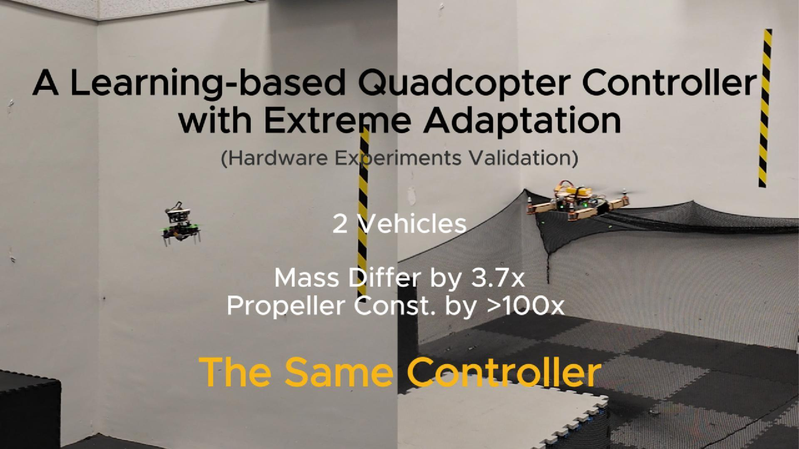

# A Learning-based Quadcopter Controller with Extreme Adaptation
This repo contains the code associated with the paper *A Learning-based Quadcopter Controller with Extreme Adaptation*

[](https://youtu.be/kZEU8lxMZug?si=Y8grEiGLXqEeb2c6)

#### Paper and Video

If you use this code in an academic context, please cite the following publication:

Paper: [ A Learning-based Quadcopter Controller with Extreme Adaptation](https://arxiv.org/abs/2409.12949) 

Video: [YouTube](https://youtu.be/kZEU8lxMZug?si=Y8grEiGLXqEeb2c6)


```
@misc{zhang2024learningbasedquadcoptercontrollerextreme,
      title={A Learning-based Quadcopter Controller with Extreme Adaptation}, 
      author={Dingqi Zhang and Antonio Loquercio and Jerry Tang and Ting-Hao Wang and Jitendra Malik and Mark W. Mueller},
      year={2024},
      eprint={2409.12949},
      archivePrefix={arXiv},
      primaryClass={cs.RO},
      url={https://arxiv.org/abs/2409.12949}, 
}
```


### Usage

We can run the following scipts to see the simulation of trajectory tracking with our controller.
```
bash setup.bash
```