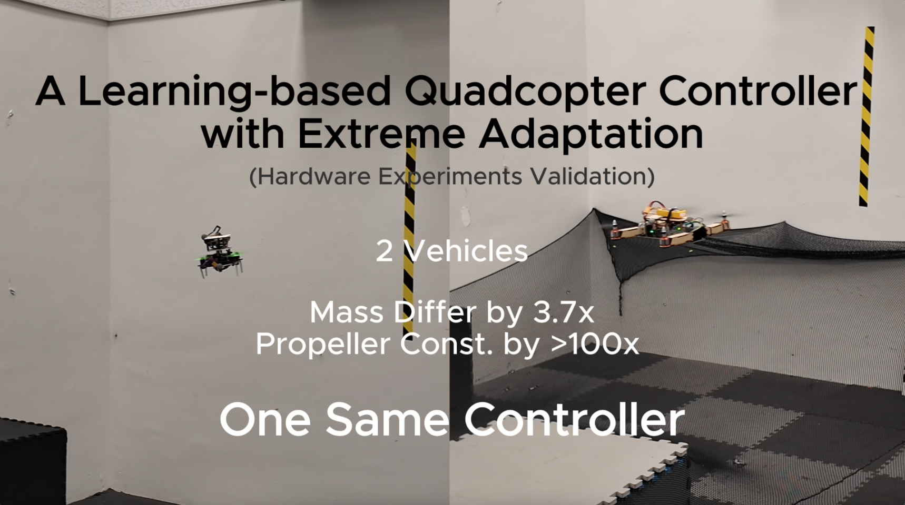

# A Learning-based Quadcopter Controller with Extreme Adaptation
This repo contains the deployment code associated with the paper A Learning-based Quadcopter Controller with Extreme Adaptation

[](https://youtu.be/rPALquHX5Ek?si=ub-J-ZIhr-47klsT)

##### Paper and Video

Paper: [TODO]() 
Video: [YouTube](https://youtu.be/rPALquHX5Ek?si=ub-J-ZIhr-47klsT)

If you use this code in an academic context, please cite the following publication: 
```
@inproceedings{zhang2024xadap,
  title={A Learning-based Quadcopter Controller with Extreme Adaptation},
  TODO
}
```


### Usage

We can run the following scipts to see the simulation of trajectory tracking with our controller.
```
bash setup.bash
```